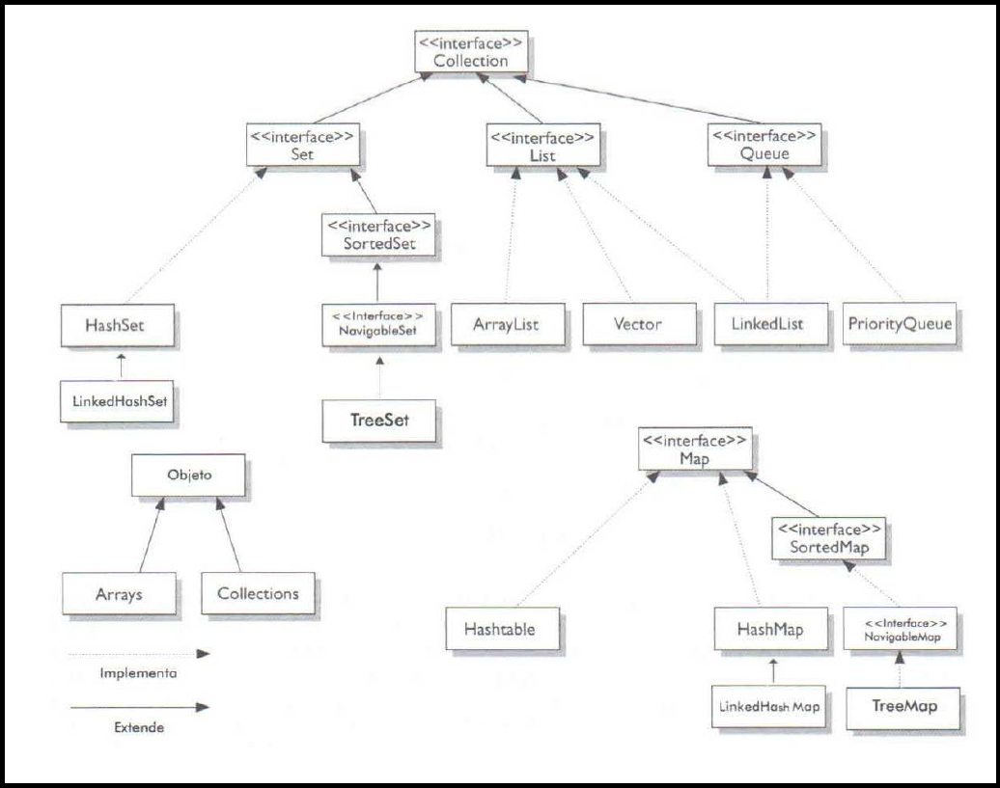

# Estudo Sobre Framework Collections - MAP
## Definição Da Framework Collections  
Coleções são estruturas da qual um objeto é capaz de agrupar outros objetos. Partindo desse princípio, a Framework Collections pode ser definida como:
> "uma arquitetura unificada para representação e manipulação de coleções."[[1]]

A Java Collections Framework também é muito útil, pois ajuda a minimizar o esforço de programação, reduz o esforço de aprender API e ajuda na reutilização de software.[[1]] Esta Framework possui o seguinte diagrama:

 

    

Como se pode observar, ela é composta por interfaces e suas respectivas implementações. Ademais, nota-se também que a palavra "_Collections_" pode possuir diferentes sentidos:[[2]]
- Ela pode se referir a qualquer coleção, como List, Set, Map e Queue;
- Quando escrita com "_C_" maiúsculo e "_s_" no final, ela se refere a classe Collections;
- Quando escrita somente com "_C_" maiúsculo e **sem** "_s_" no final, ela se refere a a interface Collection;

As coleções ainda podem ser ordenadas e/ou classificadas[[2]]:

- Para ser ordenada, os elementos da coleção devem poder ser iterados numa ordem específica. Esta ordem específica pode ser relacionada aos índices dos elementos ou até mesmo o momento em que foi inserido os elementos.
- Para ser classificada, os elementos da coleção devem respeitar uma ordem estabelecida por regras. Dessa maneira, toda coleção classificada é também uma coleção ordenada. Entretanto, esta "ordem estabelecida por regras" (ordem de classificação) não esta relacionada aos indices ou momentos de inserção dos elementos, mas sim as propriedades dos elementos. Ainda, a ordem de classificação também pode ser chamada de ordem natural quando associada a classe "_Comparable_".

Para este estudo, irá ser feito um estudo sobre coleção "_Map_".

## MAP - Definição E Características
Map é um tipo de coleção estruturada em torno do conceito de key/value (chave/valor). Assim, utilizando-se um Map, é possível associar uma chave ao valor um valor. Tanto a chave quanto o valor são objetos quaisquer que irão ser mapeados. Por fim, observa-se no diagrama UML acima que a coleção Map possui quatro implementações principais:[[2]]
- HashTable é uma classe similar a Vector, no sentido que ela é thread-safe (sincronizada). A Hashtable não permite o uso de null para o mapeamento.
- HashMap é uma classe não ordenada e não classificada. Diferentemente do Hashtable, o HashMap permite uma chave"_null_" e diversoes valores "_null_". A HashMap é ideal para aplicações com muito adições e/ou remoções, mas não é muito otimizada para iterações.
- LinkedHashMap é similar ao HashMap, mas possui ordem de inserção. Em contrapartida com o HashMap, a LinkedHashMap é melhor para iteração, mas não é adequada ser para inserção e remoção de elementos.
- TreeMap é uma classe ordenada que permite customização através das interdaces _Comparable_ e _Comparator_. A TreeMap é ideal em operações de ordenação, mas não é recomendada para adição e remoção de elementos.

## Principais Métodos
Os pricipais métodos da coleção Map são:[[3]]
- isEmpty(): returna "_true_" se o mapa não contém elementos;
- put(K k, V v): associa a chave k com o valor v;
- get(Object k): retorna o objeto mapeado a chave k, ou "_null_" se não houver nenhum objeto mapeado;
- size(): retornar a quantidade de mapeamentos num mapa;
- values(): retorna um objeto "_Collection_" com os valores contidos no mapa (alterações no mapa são refletidas no objeto Collection e vice-versa);
- replace(K k, V v): susbstitui o valor associado a chave k pelo novo valor  v;
- clear(): remove todos os mapeamentos do mapa;
- keySet(): retorna um objeto "_Set_" com as chaves do mapa (alterações no mapa são refletidas no objeto Set e vice-versa);
- forEach(BiConsumer<? super K,? super V> ação): realiza a dada ação para cada elemento do mapa;

## Exemplo De Programa Usando Algumas Dos Principais Métodos

Programa De Cadastro Simples Com HashMap:

Cada classe desse programa possui uma função específica:
- A classe "_Main_" é resposável por cadastrar os clientes através da classe "_Cadastro_" e os mapear com um número inteiro, que representa o id dos clientes. Além disso, a classe "_Main_" imprime os clientes através da classe "_Action_". O mapa ainda aplicou o importante método "_isEmpty()_" para a impressão dos elementos.
- A classe "_Action_" extende de BiConsumer<T, U> e representa uma ação que irá ser feita em cada elemento do mapa através do método "_forEach()_".
- A classe "_Cadastro_" representa um cliente que possui um nome, uma descrição (email, rua ou qualquer idenficador adicional) e um número de telefone. A classe "_Cadastro_" possui um método "_setCliente()_" para cadastrar todas as informações do cliente de uma só vez, mas os setters também são uma opção. Ainda, percebe-se que o método "_toString()_" foi sobrecarregado, pois é através desse métodos que irá se imprimir o cliente no Console.

## Comparable E Comparator
A Interface Comparable define a "ordem natural" dos objetos de uma classe. Esta "ordem natural" pode ser encotrada em diversas classes no Java: Integer, Long, String, Date, etc. Para a classe String, por exemplo, ela define que os objetos devem ser classificados em ordem alfabética. Já para Integer, a "ordem natural" especifica que os objetos devem estar em ordem crescente. Para ser usada, a interface "_Comparable_" precisa ser implementada e seu único método ("_compareTo()_") sobrecarregado. Assim sendo, as classes que implementarem "_Comparable_" irão possuir objetos com uma ordem já pré-estabelecida, a "ordem natural". 

A classe "_Comparator_" é usada para especificar outra ordenação para classes que já implementam "_Comparable_". Com isso, se for necessário ordenar os objetos de uma classe "A" de outra maneira, poderia ser criado uma classe auxiliar "B" que implementa a interface Comparator e sobrecarrega o método compare(). Desse modo, poderia se fazer uso de métodos da classe "_Collections_", como o "_sort()_", ou instanciar um TreeMap com a classe auxiliar "B".[[2]]

No aplicação abaixo, foi usado o método da classe auxiliar:

Nessa aplicação, a classe "_Cadastro_" ganhou um variável "quantidade" que representa a quantidade de itens comprados pelo cliente. Em seguida, foi criado a classe auxilixar "_QuantidadeComparator_" para que ordene o mapa de modo que o cliente com a menor quantidade de itens seja o primeiro. Na classe "_Clientes_" foi criado os métodos capazes de retornar um mapa com "ordem natural" e outro mapa com ordem por quantidade de itens. Por fim, ao ser implementado na classe "_Main_", percebe-se que o mapa com "ordem natural" ordenou os clientes com base no id, enquanto que o mapa com ordem por quantidade colocou os clientes com a quantidade de itens com ordem crescente.

## Referências

1. Java Tutorials
2. Certificação Sun Para Programador Java 6. Guia De Estudos
3. Oracle Documentation

[1]: <https://docs.oracle.com/javase/tutorial/collections/intro/index.html>
[2]: <https://www.amazon.com.br/Certifica%C3%A7%C3%A3o-Para-Programador-Java-Estudos/dp/8576083035>
[3]: <https://docs.oracle.com/en/java/javase/16/docs/api/java.base/java/util/Map.html>
