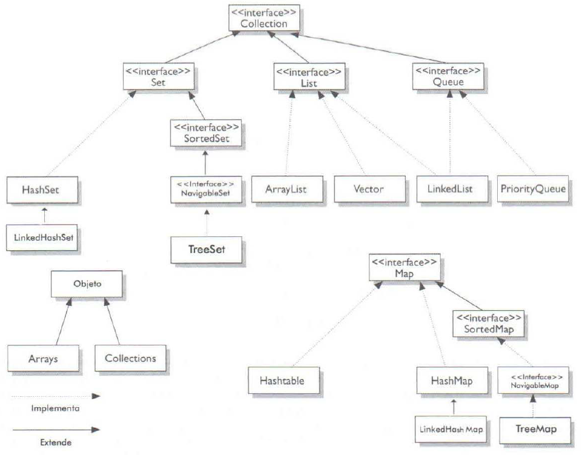

# Estudo Sobre Framework Collections - MAP
## Definição Da Framework Collections  
A Framework Collections ajuda a minimizar o esforço de programação, reduz o esforço de aprender API e ajuda na reutilização de software.[[1]]. Diagrama Do Framework Collections:

 

    

[1]: <https://docs.oracle.com/javase/tutorial/collections/intro/index.html>

Como se pode observar, ela é composta pelas interfaces e suas respectivas implementações. Ainda, pode surgir uma confusão associadas a palavra "_Collections_":[[2]]
- Ela pode se referir a qualquer coleção, como List, Set, Map e Queue;
- Quando escrita com "_C_" maiúsculo e "_s_" no final, ela se refere a classe Collections;
- Quando escrita somente com "_C_" maiúsculo e **sem** "_s_" no final, ela se refere a a interface Collection;

As coleções ainda podem ser ordenadas e/ou classificadas[[2]]:
* Para ser ordenada, os elementos da coleção devem poder ser iterados numa ordem específica. Esta ordem específica pode ser relacionada aos índices dos elementos ou atém mesmo o momentos em que foi inserido os elementos.
* Para ser classificada, os elementos da coleção devem respeitar uma ordem estabelecida por regras. Dessa maneira, toda coleção classifica é também uma coleção ordenada. Entretando, esta "ordem estabelecida por regras" (ordem de classificação) não esta relacionada aos indices ou momentos de inserção dos elementos, mas sim as propriedades dos elementos.

Para este estudo, iremos focar na Coleção "_Map_".

## MAP - Definição E Características
MAP é um tipo de coleção estruturada em volta do conceito de key/value (chave/valor). Assim, com um MAP é possível obter um valor através de uma chave, onde tanto a chave quanto o valor são objetos. Como evidenciado no diagrama UML acima, a interface Map possui quatro principais implementações: Hashtable, HashMap, LinkedHashMap e TreeMap.

## Principais Métodos
- isEmpty(): returna "_true_" se o mapa não contém elementos;
- put(K k, V v): associa a chave k com o valor v;
- get(Object k): retorna o objeto mapeado a chave k, ou "_null_" se não houver nenhum objeto mapeado;
- size(): retornar a quantidade de mapeamentos num mapa;
- values(): retorna um objeto "_Collection_" com os valores contidos no mapa (alterações no mapa são refletidas no objeto Collection e vice-versa);
- replace(K k, V v): susbstitui o valor associado a chave k pelo novo valor  v;
- clear(): remove todos os mapeamentos do mapa;
- keySet(): retorna um objeto "_Set_" com as chaves do mapa (alterações no mapa são refletidas no objeto Set e vice-versa);
- forEach(BiConsumer<? super K,​? super V> ação): realiza a dada ação para cada elemento do mapa;

## Exemplo De Programa

Programa De Cadastro Simples Com HashMap:

[1]: <https://docs.oracle.com/javase/tutorial/collections/intro/index.html>
[2]: <https://www.amazon.com.br/Certifica%C3%A7%C3%A3o-Para-Programador-Java-Estudos/dp/8576083035>
